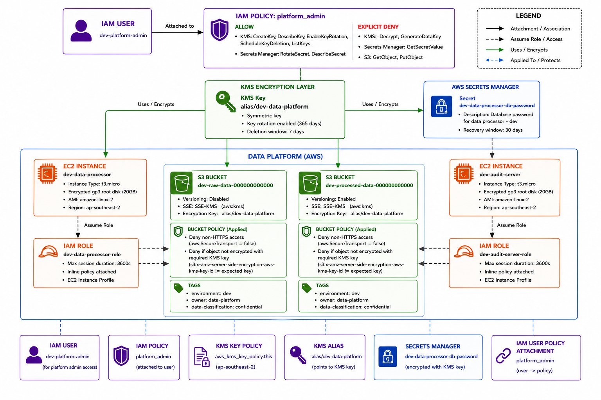

# devsecops_lab
End-to-end DevSecOps lab covering infrastructure as code, security gates, and application deployment. Each component represents a distinct discipline: infrastructure provisioning, application development, containerization, and security gates integrated across the delivery pipeline.

---

## Architecture Overview



---

## Repository Structure

```
terraform/
├── environments
│   ├── dev                   # dev environment — independent state and config
│   │   ├── backend.tf
│   │   ├── main.tf
│   │   ├── terraform.tfvars
│   │   └── variables.tf
│   └── staging               # staging environment — independent state and config
│       ├── backend.tf
│       ├── main.tf
│       ├── terraform.tfvars
│       └── variables.tf
├── modules
│   ├── ec2                   # EC2 instance with encrypted volume and instance profile
│   ├── iam                   # IAM user with environment-scoped naming
│   ├── iam_role              # IAM role with instance profile and EC2 trust policy
│   ├── kms                   # KMS key with rotation and environment alias
│   ├── s3                    # S3 bucket with versioning, SSE, and bucket policy
│   └── secrets               # Secrets Manager secret with ephemeral password
└── policies
    ├── audit-server-role.json.tpl
    ├── data-processor-role.json.tpl
    ├── kms-key.json.tpl
    └── platform-admin-user.json.tpl

dummy_api/
├── cmd/
│   └── main.go               # Lambda entrypoint — Chi router with Lambda adapter
├── handler/
│   ├── health.go             # Health check endpoint
│   ├── negative_response.go  # Shared error response helpers
│   └── tasks.go              # Task creation and retrieval handlers
├── Dockerfile
├── go.mod
├── go.sum
└── openapi.yml                # OpenAPI spec used for the ZAP API scan
```

Each environment directory is self-contained with its own backend, variables, and state. Modules are environment-agnostic and accept an `environment` variable to scope all resource names and tags. Policy documents live in `terraform/policies/` as template files rendered at apply time via `templatefile()`.

---

## Prerequisites
- Docker
- Terraform
- AWS CLI

---

## Setup

### Environment Variables
`.env.example` contains all required variables with placeholder values. Values should be updated to match the target environment before running any commands.

```bash
cp .env.example .env
```

The `.env` file must be sourced before running Terraform commands:
```bash
source .env
```

### AWS CLI
The following alias is used to interact with MiniStack using the AWS CLI:
```bash
alias minstack='docker run --network devsecops_lab_ministack -e AWS_ACCESS_KEY_ID=test -e AWS_SECRET_ACCESS_KEY=test -e AWS_REGION=ap-southeast-2 --rm -it amazon/aws-cli --endpoint-url=http://ministack:4566'
```

> **Note:** MiniStack must be running before the alias can be used.

Example usage:
```bash
minstack s3 ls
minstack s3 ls s3://devsecops-lab/
```

### MiniStack
MiniStack is started using Docker Compose:
```bash
docker compose up -d
```

Once MiniStack is running, the state bucket must be created before initializing Terraform:
```bash
minstack s3 mb s3://devsecops-lab
```

### Floci
Floci runs alongside MiniStack and handles Lambda execution and ECR. Unlike MiniStack which emulates AWS services at the API level, Floci spins up real Docker containers for Lambda invocations enabling actual function execution.

The following alias is used to interact with Floci using the AWS CLI:
```bash
alias floci='docker run --network host -e AWS_ACCESS_KEY_ID=test -e AWS_SECRET_ACCESS_KEY=test -e AWS_REGION=ap-southeast-2 --rm amazon/aws-cli --endpoint-url=http://localhost:4567'
```

### Terraform
Each environment must be initialized separately:
```bash
cd terraform/environments/dev && terraform init
cd terraform/environments/staging && terraform init
```

---

## CI/CD Pipeline

### Overview
The pipeline runs on GitHub Actions with a self-hosted runner co-located on the same machine as MiniStack. Since MiniStack is only reachable at `localhost:4566`, a GitHub-hosted runner is not an option as it has no route to the local network. Terraform is invoked as a native binary on the runner rather than through a marketplace action for the same reason: container-based actions resolve `localhost` to the container, not the host, severing the connection to MiniStack.

### Branching Strategy

```
feature/*  ->  development  ->  main
                    |             |
                   dev         staging
```

| Branch | Trigger | Action |
|---|---|---|
| `feature/*` | PR to `development` | Plan only |
| `development` | Merge (push) | Apply to dev |
| `main` | Merge (push) | Apply to staging |

Code must pass dev before promoting to staging via PR from `development` to `main`.

### Workflows

#### terraform-plan.yml
Triggered on pull request targeting `development` or `main`.

| Stage | Tool | Fails on |
|---|---|---|
| Secret scanning | GitLeaks | Any secret detected |
| IaC security scan | Trivy | HIGH or CRITICAL findings |
| Terraform validate | terraform validate | Any validation error |
| Terraform plan | terraform plan | Any plan error |

The plan output is posted as a PR comment for review before merging. All stages must pass for the PR to be mergeable.

#### terraform-apply.yml
Triggered on push to `development` or `main`, only when files under `terraform/` change.

| Stage | Tool | Fails on |
|---|---|---|
| Secret scanning | GitLeaks | Any secret detected |
| IaC security scan | Trivy | HIGH or CRITICAL findings |
| Terraform apply | terraform apply -auto-approve | Any apply error |

Security scans are repeated at apply time independently of the plan workflow. Plan and apply are separate workflow runs and security must be verified at both stages.

#### dummy-api-deploy.yml
Triggered on push to `development` or `main`, only when files under `dummy_api/` change.

| Stage | Tool | Fails on |
|---|---|---|
| Secret scanning | GitLeaks | Any secret detected |
| SAST | Semgrep | Any finding matching configured rules |
| Container image build | Docker | Any build error |
| Container security scan | Trivy | CRITICAL findings |
| Container image push | Docker | Any push error |
| Lambda deploy | AWS CLI via Floci | Any deployment error |
| Smoke test | curl | Non-200 response from health endpoint |
| DAST scan | OWASP ZAP | HIGH risk findings |

The IaC and application pipelines are intentionally separate. Infrastructure changes and application changes trigger independent pipelines, reflecting real-world separation of concerns between platform and development teams.

### Required Secrets

Configure in GitHub -> Settings -> Secrets -> Actions:

| Secret | Description |
|---|---|
| `AWS_ACCESS_KEY_ID` | MiniStack and Floci dummy credential |
| `AWS_SECRET_ACCESS_KEY` | MiniStack and Floci dummy credential |
| `AWS_DEFAULT_REGION` | Target region (`ap-southeast-2`) |
| `DOCKERHUB_USERNAME` | Docker Hub username for base image pulls |
| `DOCKERHUB_TOKEN` | Docker Hub access token |

---

## Infrastructure

### Resources
Each environment provisions the following resources:

| Resource | Name | Description |
|---|---|---|
| KMS Key | `alias/<environment>-data-platform` | Encryption key for all environment resources |
| S3 Bucket | `<environment>-raw-data-<account_id>` | Ingestion of raw financial data |
| S3 Bucket | `<environment>-processed-data-<account_id>` | Storage of processed financial data |
| EC2 Instance | `<environment>-data-processor` | Reads raw data and writes processed data |
| EC2 Instance | `<environment>-audit-server` | Read-only access to both buckets for auditing |
| IAM User | `<environment>-platform-admin` | Platform administration with no direct data access |
| IAM Role | `<environment>-data-processor-role` | Least privilege role for data-processor instance |
| IAM Role | `<environment>-audit-server-role` | Read-only role for audit-server instance |
| IAM Policy | `<environment>-platform-admin-policy` | Admin policy with explicit data access denials |
| Secrets Manager Secret | `<environment>-data-processor-db-password` | Database password for data-processor, encrypted with environment KMS key |

### Modules
Resources are provisioned through reusable modules located under `terraform/modules/`:

| Module | Description |
|---|---|
| `kms` | KMS key with rotation enabled and environment-scoped alias |
| `s3` | S3 bucket with versioning, server side encryption, and bucket policy enforcement |
| `ec2` | EC2 instance with encrypted root volume, optional secret retrieval on boot, and instance profile attachment |
| `iam` | IAM user with environment-scoped naming |
| `iam_role` | IAM role with inline permission policy, instance profile, and EC2 trust policy |
| `secrets` | Secrets Manager secret with ephemeral password generation and KMS encryption |

### Encryption
Each environment provisions a dedicated KMS key used to encrypt all applicable resources. S3 buckets enforce server side encryption using the environment KMS key and deny any request not using HTTPS or unencrypted uploads via bucket policy. EC2 root volumes are encrypted using the same environment KMS key with 20GB gp3 configuration. KMS key rotation is enabled with a 365-day rotation period.

State files are stored in S3 with `encrypt = true` configured on the backend. On real AWS this enforces SSE at rest via the S3 backend.

### Ephemeral Resources
The database password for `data-processor` is generated using an ephemeral `random_password` resource and stored in Secrets Manager using a write-only attribute (`secret_string_wo`). The password is never written to Terraform state. The secret is encrypted with the environment KMS key.

The `data-processor` instance retrieves the secret at boot via user data and writes it to `/opt/app/db.env` with `600` permissions. The `audit-server` has no secret requirement and does not receive a secret ARN.

Using an ephemeral resource over a standard `random_password` ensures the plaintext password never appears in state, removing a common credential exposure vector in infrastructure-as-code pipelines.

### Identity and Access

Each EC2 instance is assigned a dedicated IAM role via an instance profile. Policy documents are rendered from `templatefile()` at apply time and scoped to environment-specific resource ARNs only.

| Principal | s3:GetObject raw | s3:PutObject processed | s3:GetObject processed | kms:Decrypt | kms:Manage | secretsmanager:GetSecretValue |
|---|---|---|---|---|---|---|
| `data-processor-role` | ✓ | ✓ | ✗ | ✓ | ✗ | ✓ |
| `audit-server-role` | ✓ | ✗ explicit deny | ✓ | ✓ | ✗ | ✗ |
| `platform-admin` | ✗ explicit deny | ✗ explicit deny | ✗ explicit deny | ✗ explicit deny | ✓ | ✗ explicit deny |

The KMS key policy enforces the access matrix at the key level independently of IAM policies, providing defense in depth. The root account retains full key access to prevent lockout.

Cross-environment S3 access is explicitly denied on `data-processor-role` via a `NotResource` deny statement covering all granted S3 actions.

### Environment Separation
Directory-based environment separation is used instead of Terraform workspaces. Each environment has its own backend configuration, variable definitions, and state file to ensure strict isolation and prevent accidental cross-environment operations.

Workspaces are not suitable for this use case as they share a backend configuration and do not provide true environment isolation.

### Usage
Provision an environment:
```bash
cd terraform/environments/<environment>
terraform apply
```

Destroy an environment:
```bash
cd terraform/environments/<environment>
terraform destroy
```

Both environments are independent and can be provisioned or destroyed separately.

---

## Application

### Overview
A lightweight HTTP API built with Go demonstrating concurrent task management using mutex-protected in-memory storage. The application is deployed to AWS Lambda via Floci using a container image, with requests routed through a Lambda Function URL. Storage is intentionally in-memory for demonstration purposes.

### Endpoints

| Method | Path | Description |
|---|---|---|
| `GET` | `/health` | Returns service health status |
| `POST` | `/tasks` | Creates a new task, returns UUID and status |
| `GET` | `/tasks/{id}` | Retrieves a task by UUID |

### Architecture
The application uses the Chi router with `aws-lambda-go-api-proxy` to bridge standard Go HTTP handlers to the Lambda runtime. This allows the application to be written as a standard HTTP server without tight coupling to Lambda-specific event types.

Concurrent access to the in-memory task store is managed via `sync.RWMutex`, allowing multiple readers or a single writer at any time.

### Lambda Emulator
Floci is used as the local Lambda emulator. Unlike MiniStack, Floci spins up a real Docker container for each Lambda invocation, enabling actual Go binary execution. The container image is built from a distroless base, pushed to Floci ECR on port `5100`, and deployed to Lambda via the Floci endpoint on port `4567`.

### DAST Scanning
The dummy API is scanned with OWASP ZAP (`zap-api-scan.py`) against the deployed Lambda Function URL rather than a locally running instance of the application. This is possible because Floci spins up a real container for each Lambda invocation, and the Function URL is configured with `AUTH_NONE`, giving ZAP a genuine HTTP endpoint to attack rather than a mocked one. The scan therefore exercises the same artifact that gets deployed, not a substitute. On real AWS, Function URLs are HTTPS only; the local Floci emulation serves this over plain HTTP since it does not terminate TLS.

Scanning is driven by a static OpenAPI spec (`dummy_api/openapi.yml`) rather than ZAP's built in spider. The API returns JSON with no HTML links or forms for a crawler to follow, so discovery based scanning finds little beyond `GET /health`. The spec explicitly defines all three endpoints, including request and response schemas, and is the only way ZAP discovers and exercises `POST /tasks` and `GET /tasks/{id}`.

The Function URL is only known after deployment and changes whenever the function is recreated, so the spec's `servers.url` is overridden at scan time with the `-O` flag rather than committing a generated URL to the spec file. This keeps the spec a stable, version controlled artifact while the pipeline supplies the dynamic target at runtime. The scan itself runs with `--network host`, since the Function URL resolves under a `.localhost` subdomain that ZAP's container cannot otherwise reach from inside its own network namespace.

#### Known Limitation: Path Parameter Coverage
`GET /tasks/{id}` is tested using a placeholder UUID supplied as the spec's parameter example, since `zap-api-scan.py` has no mechanism to chain requests. It cannot capture a UUID from a `POST /tasks` response and reuse it in a subsequent `GET`. As a result the endpoint is always exercised with a value that does not correspond to a real task and always returns a 404.

This is an acceptable gap for the current implementation. Tasks are stored in memory, and the 404 and 200 code paths are functionally identical: both serialize a struct to JSON with no branching logic in between, so a successful lookup carries no additional attack surface that the 404 path does not already cover. A database backed implementation would not have this luxury, since the 200 path would execute a real query while the 404 path returns early without touching the data layer. In that case the correct approach is pre-seeding known test data before the scan runs and injecting a real ID into the spec, so ZAP exercises the code path that actually matters.

#### Pipeline Gating
The scan produces both HTML and JSON reports, which are uploaded as workflow artifacts regardless of outcome so failed runs remain inspectable. The pipeline only fails the build on HIGH risk findings (`riskcode: 3`); Low, Medium, and Informational findings are recorded in the report but do not block deployment. This mirrors the threshold already applied to the Trivy container scan in the same workflow, where only CRITICAL severity is treated as a blocking failure.

### Local Emulator Note
Both MiniStack and Floci are local AWS emulators used for development and portfolio demonstration purposes. MiniStack handles IaC resource provisioning. Floci handles Lambda execution and ECR. Neither replaces real AWS in production but together they provide a cost-free, fully functional local DevSecOps environment.